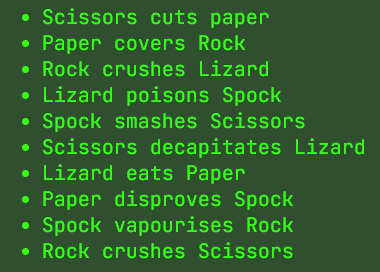

# Rock Paper Scissors Lizard Spock

[Live link to the site](https://dandon1990.github.io/RPSLS/index.html)

## About
The rock paper scissors lizard spock game is a fun game for kids or adults to see if they can beat the computer. Tha aim of the game is to make a choice of weapon that beats the computer's weapon. Similar to a game played as kids or a decider to who goes first for adults.

This game comes with 5 different options to choose from (see title of the game). This means that each option now has 2 weaknesses instead of just one. It also mean that it has strength over 2 options. This makes it a bit more interesting and makes the user think more strategically.

## Design 
I wanted to pick a theme that suggested old school science and computers since the game comes from the Tv Show 'The Big Bang Theory' which is a comedy sitcom based on science.

### Colour Scheme
The colour scheme I picked:
* Neon Green #39ff14: Used for text colour

* Dark Green #2f4f2f: Used for background colour.

* Gray98 #fafafa: Used for Hover aspects and details.

### Font
I used JetBrains Mono for the Font of the website. I feel like it gives it a Science/Computer look about the text when mixed with the Neon Green Colour.

## Features
The design of the website was to have 2 pages. A Home/Landing page, to explain the game, and the Game page.

### Home Page
The home page has a hero image which displays the flow of the game. It shows which weapons beat other weapons. There is information about the game and a list of confirming which weapons beat others. I have also put a table in showing which weapons are superior over others to simplify it for the user as there are a few variations to remember.

### Hero Image

### Navigation Bar

The Navigation Bar allows the user to switch between the home page and the game page easily. It has an active tab so that the user knows which tab they are on.

### Rules Section

The rules have have been split into sections making it easier for the user to understand them. The paragraph describes a twist on the old classic Rock, Paper, Scissors game.

The list provides how each weapon wins over the other choices.

The table gives an easy viual for the user to know what each weapon wins over.

### Footer

* The footer section appears on all the pages and contains the scoial media links for Rock, Paper, Scissors Lizard, Spock Game. All links will be opened in a new tab for a better user experience and easier navigation.
* All of the links change colour when hovered over to let the user know that they are click-able links.
* The footer provides value to the user as it allows them to be consistently connected to the Community through social media. 

### Game Page

#### Buttons

The buttons are where the user makes their choice of weapon. Each button has a FontAwesome Icon representing each weapon making it a better user experience. When hovered over the text and icon changes colour to let the user know it's an interactive button.

#### Game Results and Score Counter

The choices and result section allow the user to confirm their weapon choice as well as the computer choice which is choosen at random using a JavaScript function.

The section also allows the user to view the score between them and the computer. When either the user or computer reach the score of 10 a message will appearing telling the user whether they won or lost and if the want to play again.

## Testing

### Responsive Design

* Media Queries were used for different screen widths:
**1100px, 970px, 675px, 380px**
* These screen widths allowed the integrity of the game to be played on all devices (mobile, tablet and desktop)

#### Browser Testing
* I tested the Site on **Google Chrome, Microsoft Edge and Firefox**
* All functionality tested okay with these browsers and the responsiveness remained

### Manual Testing

* Manual testing was done for the Nav Bar from each page and the correct page loaded each time. The Game also resets when the Play tab is clicked.

* All social media links open in a new tab from both pages.

* All buttons display the correct selections in the Player Choice Display on the game page

* A computer choice is generated every time the user makes a selection.

* The result is always calculated every time the user makes a choice and it's always correct.

* The correct score counter is incremented everytime the user makes a selcetion

* The correct Hidden message appears when either the user or computer wins the game (first to 10)

### Lighthouse
Home

Play

Both pages were put through lighthouse testing report on Google Dev Tools and this was the results.

### Code Validators

* Both pages were tested on [W3C](https://validator.w3.org/) to check for HTML errors and returned with no errors

* Both pages were tested on [Jigsaw](https://jigsaw.w3.org/css-validator/) to check for CSS errors and returned no errors

* The JavaScript was tested on [Jshint](https://jshint.com/) and showed no errors

## Deployment

This site was deployed using Github Pages using the following steps:
1. Log in to [GitHub](https://github.com/).
2. From the list of Repositories, select [RPSLS](https://github.com/dandon1990/RPSLS).
3. Navigate to [Settings](https://github.com/dandon1990/RPSLS/settings). 
4. Scroll down through the options to [GitHub Pages](https://github.com/dandon1990/RPSLS/settings/pages).
5. From the source section drop-down menu, select the **Master Branch**.
6. The second drop-down menu value should remain as **/(root)**
7. Press Save
8. Refresh the page, scroll back down to **GitHub Pages**, the link to the deployed site will be available in a green sub-section with a tick icon next to it.

Live link can be found here - https://dandon1990.github.io/RPSLS/

## Credits

### Rules and content of the game
* https://the-big-bang-theory.com/

### Images
* The hero image was taken from [PngKey](https://www.pngkey.com/)
* [Fav Icon](https://favicon.io/) 

### Fonts and Icons
* Fonts were used from [Google Fonts](https://fonts.google.com/).
* Icons for social media links were taken from [Font Awesome](https://fontawesome.com/).
### Colours 
* The colour scheme throughout was thought of by using Colour Palette Generator [Coolors](https://coolors.co/).
### Code 
* Code throughout the site has been helped by various different sources including:
    * The [Love Maths](https://github.com/Code-Institute-Solutions/love-maths-2.0-sourcecode) project.
    * [CSS Tricks](https://css-tricks.com/) 
    * [Stackoverflow](https://stackoverflow.com/)
    * [W3schools](https://www.w3schools.com/default.asp)
    * [Youtube Tutorials](https://www.youtube.com/)
    * The [Code Institute](https://learn.codeinstitute.net/) tutor support and LMS materials